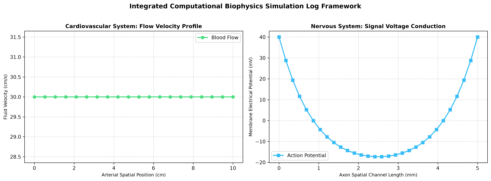

# BiomedicalSystemsSolver: Neuro-Computational & Hemodynamic Engines

A multi-domain computational biophysics simulation suite implementing discrete numerical finite-difference equations. This project dual-models transient biological signaling and physical mechanics properties across mammalian grids.

Targeted for neural and biophysics research in **Modeling and Simulation Engineering**.

## 🧠 Electrophysiology Framework (Nervous System)
The neural propagation model solves the discrete one-dimensional spatial cable differential equation. The system tracks signal conduction velocity decays and active ion leaks along an automated axon channel path:

### 📍 Computational Domain (Where the System Models)
The framework maps transient electrical potential transformations across a discrete 100-node localized array grid modeling an unmyelinated **Neural Axon Segment**:
* **Physical Scale Discretization:** Tracks localized finite-difference grid nodes separated by fine spatial steps ($\Delta x = 0.01 \ \text{cm}$) over an absolute $1 \ \text{cm}$ total experimental axon pathway.
* **Transient Boundary Conditions:** Enforces sealed-end (no-flux) boundary rules at the distal terminus ($\frac{\partial V}{\partial x} = 0$), dictating that intracellular current cannot escape the physical boundaries of the simulated fiber tip.
* **Stimulus Gateway Node:** The proximal boundary boundary node ($x = 0$) serves as the structural injection gateway, accepting an external transient stimulus current ($I_{\text{ext}}$) to trigger active depolarization cascades.

#### 🧮 Variable and Symbolic Definitions
The underlying computational logic models the following biophysical cable variables at every independent spatial matrix cell:

$$C_m \frac{\partial V}{\partial t} = \frac{1}{R_a} \frac{\partial^2 V}{\partial x^2} - I_{leak}$$

Where:
*   $V(x, t)$ : **Transmembrane Potential** — Represents the localized voltage differential across the axon membrane at space coordinate $x$ and time $t$, tracked in millivolts ($\text{mV}$).
*   $C_m$ : **Membrane Capacitance** — Holds the physical capacity of the cellular lipid bilayer to store electrical charge, normalized per unit area ($\approx 1.0 \ \mu\text{F/cm}^2$).
*   $R_a$ : **Intracellular Axial Resistance** — Models the internal fluid resistance against passive longitudinal ion current flow running through the axoplasm ($\Omega\cdot\text{cm}$).
*   $a$ : **Axon Core Radius** — Sets the physical cross-sectional scale of the neural cylinder, directly scaling longitudinal electrical conduction velocities.
* $I_{leak}$ = Active voltage leakage tracking index relative to a $-70\text{mV}$ resting baseline potential

*   **Engine Script:** `nervous_impulse_solver.py`
*   **Mathematical Scheme:** Explicit Euler transient voltage integrator loop tracking signal propagation across 30 space coordinates.

## 🫀 Hemodynamic Framework (Cardiovascular System)
The blood flow model maps transient fluid velocities via one-dimensional simplifications of the Navier-Stokes derivations, calculating viscous diffusion friction losses against vessel walls:

#### 🧮 Variable and Symbolic Definitions
The continuous partial differential equations governing this fluid grid map the following biophysical properties at every localized node:

$$\rho \left( \frac{\partial v}{\partial t} \right) = \mu \left( \frac{\partial^2 v}{\partial x^2} \right)$$

Where:
*   $v(x, t)$ : **Transient Fluid Velocity** — Represents the cross-sectional averaged blood flow velocity at a specific spatial coordinate ($x$) over time ($t$).
*   $P$ : **Intravascular Blood Pressure** — The driving hydrostatic force gradient acting along the length steps of the vessel track.
*   $\rho$ : **Blood Mass Density** — Constrained as a constant fluid mass parameter ($\approx 1.06 \ \text{g/cm}^3$) modeling standard human blood plasma weight properties.
*   $\mu$ : **Dynamic Viscosity Coefficient** — Accounts for internal fluid friction shear stresses and viscous resistance forces against the common carotid arterial walls.
*   $R$ : **Instantaneous Vessel Radius** — Tracks the dynamic structural boundaries of the arterial lumen as it dilates and contracts during systolic heart pump bursts.

*   **Engine Script:** `hemodynamic_solver.py`
*   **Mathematical Scheme:** Second-order spatial finite-difference diffusion approximation matrix tracking momentum profiles across 20 vascular nodes.
### 📍 Computational Domain (Where the System Models)
The framework maps transient fluid mass-transport boundaries across a discrete 20-node linearized structural array grid modeling the human **Arterial Vasculature Track**:
* **Primary Vessel Boundary:** Simulates spatial velocity profiles along the continuous segment path of the human **Common Carotid Artery**.
* **Spatial Scale Discretization:** Tracks localized finite-difference grid nodes separated by structural length steps ($\Delta x = 0.5 \ \text{cm}$) over an absolute $10 \ \text{cm}$ computational vessel track length.
* **Boundary Nodes:** Enforces non-slip viscous conditions at the interior vessel walls and continuous transient boundary pressure influx nodes at the proximal heart ejection boundary gateway.


## 🚀 Local Deployment Lifecycle

### Prerequisites
* Python 3.10+
* NumPy
* Matplotlib

### Execution
Run the data science visualization module locally to calculate both engines and export your side-by-side subplot panel matrix graphic:
```bash
python generate_biomed_plots.py
```

## 📈 Simulation Analytics Visualization

